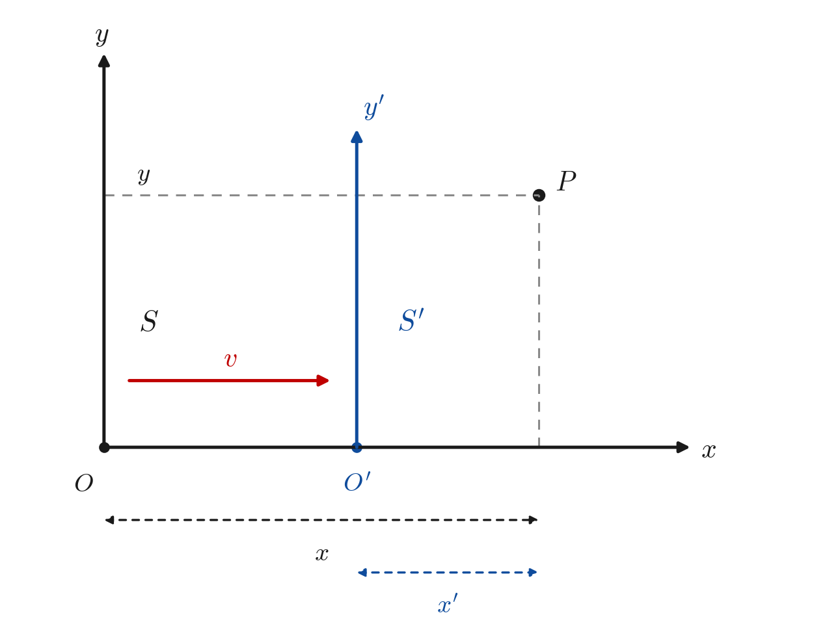

# 洛伦兹变换的推导 {#sec-lorentz-derivation}

## 公理设定

洛伦兹变换的推导，只需立足于三条最弱的前提：变换的线性性、不变速度的存在，以及变换集合的群结构。
换言之，我们并不预设“光”这一具体物理对象，而只假定时空具有均匀性与各向同性，并存在一个在所有惯性系中取值相同的特征速度 $c$。

\begin{axiom}[均匀性假设（线性变换）] \label{ax-homogeneity}
空间是均匀的，时间是均匀的。因此，两个惯性系 $S$ 和 $S'$ 之间的坐标变换必须是线性变换（齐次线性变换加平移，这里取原点重合的齐次部分）。
\end{axiom}

\begin{axiom}[存在不变速度] \label{ax-invariant-speed}
存在一个恒定的特征速度 $c$，在任何参考系中，沿任意方向测量该速度都恒为 $c$。这意味着如果 $x = ct$，则在 $S'$ 中必有 $x' = ct'$；若 $x = -ct$，则 $x' = -ct'$。
\end{axiom}

\begin{axiom}[协变性（群结构）] \label{ax-covariance}
所有的空间方向是对称的（各向同性），且变换构成的集合必须形成“群”：即连续做两次变换等于做一次变换，且存在逆变换回到原坐标系。
\end{axiom}

## 建立一般线性变换形式

设 $S'$ 系相对于 $S$ 系以速度 $v$ 沿 $x$ 轴正向运动，两系对应的坐标轴两两平行，且在 $t = t' = 0$ 时原点重合。两系的几何关系如图 @fig-lorentz-frames 所示。本节先在 $x$–$t$ 平面内建立变换；横向坐标 $y$、$z$ 保持不变这一结论将在 @sec-lorentz-4d 节中由对称性严格证明，届时将看到二维推导对四维变换是完全充分的。

{#fig-lorentz-frames width=60%}

由于变换是线性的，$x$–$t$ 平面内的通式可以写为：

$$
x' = Ax + Bt
$$ {#eq-lin-x}

$$
t' = Cx + Dt
$$ {#eq-lin-t}

其中 $A, B, C, D$ 是待定的常数（只依赖于 $v$ 和 $c$）。

### 约束 1：追踪 $S'$ 的原点

$S'$ 的原点 $x' = 0$，在 $S$ 系中对应 $x = vt$。代入 @eq-lin-x：

$$
0 = A(vt) + Bt \quad \Longrightarrow \quad B = -Av
$$

于是 @eq-lin-x 变为 @eq-lin-x2。

$$
x' = A(x - vt)
$$ {#eq-lin-x2}

### 约束 2：相对性原理

由 @eq-lin-x2 和 @eq-lin-t 得到变换矩阵为 @eq-lambda，它作用于列向量 $(x, t)^{\mathsf{T}}$。

$$
\Lambda =
\begin{pmatrix}
A & -Av \\
C & D
\end{pmatrix}
$$ {#eq-lambda}

$S$ 系相对于 $S'$ 系以速度 $-v$ 运动。根据公理 \ref{ax-covariance} 的群性质，从 $S'$ 到 $S$ 的逆变换必须具有相同的数学形式。

首先计算一般线性变换的行列式为 @eq-det-lambda。

$$
\det(\Lambda) = AD + AvC = A(D + vC)
$$ {#eq-det-lambda}

设 $\det(\Lambda) \neq 0$，否则变换不可逆，与群结构公理矛盾。@eq-lambda 的逆矩阵为 @eq-inv-lambda。

$$
\Lambda^{-1} = \frac{1}{\det(\Lambda)}
\begin{pmatrix}
D & Av \\
-C & A
\end{pmatrix}
$$ {#eq-inv-lambda}

由此得到从 $S'$ 到 $S$ 的变换方程：

$$
x = \frac{D}{A(D + vC)} x' + \frac{Av}{A(D + vC)} t'
$$ {#eq-transform-x}

由于 $S$ 系相对于 $S'$ 系以 $-v$ 运动，$S$ 系的原点（$x = 0$）在 $S'$ 系中满足 $x' = -v t'$。代入 @eq-transform-x：

$$
0 = \frac{D}{A(D + vC)} (-v t') + \frac{Av}{A(D + vC)} t'
$$ {#eq-substitute}

消去公因子后得：

$$
-Dv + Av = 0 \quad \Longrightarrow \quad D = A
$$ {#eq-result}

现在，变换矩阵的形式缩小为：

$$
\begin{pmatrix}
x' \\ t'
\end{pmatrix}
=
\begin{pmatrix}
A & -Av \\
C & A
\end{pmatrix}
\begin{pmatrix}
x \\ t
\end{pmatrix}
$$ {#eq-matrix-form}

## 引入恒定速度

我们要求存在一个速度 $c$，在 $S$ 系中满足 $x = ct$，且变换到 $S'$ 系后依然满足 $x' = ct'$。
代入 @eq-lin-x2 和 @eq-lin-t 的形式：

$$
x' = A(ct - vt) = A(c - v)t
$$

$$
t' = C(ct) + At = (Cc + A)t
$$

因为要求 $x' = ct'$，代入得到：

$$
A(c - v)t = c(Cc + A)t
$$

消去 $t$（$t > 0$），得：

$$
\begin{aligned}
A(c - v) &= c(Cc + A) \\
Ac - Av &= Cc^{2} + Ac \\
-Av &= Cc^{2} \quad \Longrightarrow \quad C = -\frac{Av}{c^{2}}
\end{aligned}
$$ {#eq-C-constraint}

对反向光信号 $x = -ct$（此时要求 $x' = -ct'$）作同样的计算，得到完全相同的约束，不产生新的限制。

现在，变换只依赖最后一个参数 $A$：

$$
x' = A(x - vt)
$$ {#eq-x-final-1}

$$
t' = A\left( t - \frac{v}{c^{2}}x \right)
$$ {#eq-t-final-1}

## 确定参数 $A$

我们需要确定最后一个参数 $A$。由公理 \ref{ax-covariance}，变换集合构成群：连续做一次速度为 $v$ 的变换与一次速度为 $-v$ 的变换，必须回到原坐标系，即逆变换等于速度反号的变换，$\Lambda(v)^{-1} = \Lambda(-v)$。
从矩阵形式（作用于列向量 $(x, t)^{\mathsf{T}}$）：

$$
\Lambda(v) =
\begin{pmatrix}
A & -Av \\
-Av/c^{2} & A
\end{pmatrix}
$$

逆矩阵 $\Lambda(v)^{-1}$ 应该等于 $\Lambda(-v)$：

$$
\Lambda(-v) =
\begin{pmatrix}
A & Av \\
Av/c^{2} & A
\end{pmatrix}
$$

计算 $\Lambda(v)$ 的逆矩阵（行列式 $\det = A^{2} - A^{2}v^{2}/c^{2} = A^{2}(1 - v^{2}/c^{2})$）：

$$
\Lambda(v)^{-1}
= \frac{1}{A^{2}(1 - v^{2}/c^{2})}
\begin{pmatrix}
A & Av \\
Av/c^{2} & A
\end{pmatrix}
= \frac{1}{A(1 - v^{2}/c^{2})}
\begin{pmatrix}
1 & v \\
v/c^{2} & 1
\end{pmatrix}
$$

令 $\Lambda(v)^{-1} = \Lambda(-v)$，即：

$$
\frac{1}{A(1 - v^{2}/c^{2})}
\begin{pmatrix}
1 & v \\
v/c^{2} & 1
\end{pmatrix}
=
\begin{pmatrix}
A & Av \\
Av/c^{2} & A
\end{pmatrix}
$$

比较矩阵的左上角元素：

$$
\frac{1}{A(1 - v^{2}/c^{2})} = A \quad \Longrightarrow \quad A^{2}(1 - v^{2}/c^{2}) = 1
$$

解得：

$$
A = \frac{1}{\sqrt{1 - v^{2}/c^{2}}} \equiv \gamma
$$ {#eq-gamma-def}

（这里取正号，因为要求 $v = 0$ 时变换退化为恒等变换 $A = 1$。）

## 最终形式

将 $A = \gamma$ 代入 @eq-x-final-1 与 @eq-t-final-1，我们得到 $x$–$t$ 平面内的洛伦兹变换。为与下一节四维形式的变量顺序约定 $(t, x, y, z)$ 保持一致，这里按 $t'$、$x'$ 的顺序汇总：

$$
t' = \gamma\left( t - \frac{v}{c^{2}}x \right)
$$ {#eq-final-t}

$$
x' = \gamma(x - vt)
$$ {#eq-final-x}

写成矩阵形式 @eq-final-matrix，列向量相应按 $(t, x)$ 的顺序排列，其左上角 $2 \times 2$ 块与下一节四维形式 @eq-lorentz-4d-mat 完全一致。

$$
\begin{pmatrix}
t' \\ x'
\end{pmatrix}
=
\begin{pmatrix}
\gamma & -\gamma v/c^{2} \\
-\gamma v & \gamma
\end{pmatrix}
\begin{pmatrix}
t \\ x
\end{pmatrix}
$$ {#eq-final-matrix}

## 推广到四维时空 {#sec-lorentz-4d}

前几节在 $x$–$t$ 平面内完成了推导。本节补齐四维图景：先由对称性证明横向坐标 $y$、$z$ 在变换下不变，再给出完整的四维洛伦兹变换及其矩阵形式，最后验证时空间隔的不变性。

### 横向坐标不变：对称性论证

设两系坐标轴对应平行。$y$、$z$ 坐标的一般线性变换可写为 @eq-yz-general（系数只依赖于 $v$ 与 $c$）。

$$
\begin{aligned}
y' &= a y + b z + \alpha x + \eta t \\
z' &= c y + d z + \mu x + \nu t
\end{aligned}
$$ {#eq-yz-general}

**第一步（$x$ 轴映到 $x'$ 轴）。** 由各向同性，$x$ 轴在变换下必须映到 $x'$ 轴：位于 $x$ 轴上的点（$y = z = 0$）在 $S'$ 系中的横向坐标必须为零。于是对任意 $x$、$t$ 有 $\alpha x + \eta t = 0$ 与 $\mu x + \nu t = 0$，故

$$
\alpha = \eta = \mu = \nu = 0
$$

**第二步（反射对称性）。** 将两系的 $y$ 轴同时反向（$y \to -y$，$y' \to -y'$），物理情境不变，变换形式应保持不变。在反射后的坐标下 $-y' = -ay + bz$，即 $y' = ay - bz$，与原式 $y' = ay + bz$ 比较得 $b = 0$；同理，由 $z \to -z$ 的反射对称性得 $c = 0$。于是

$$
y' = a y, \qquad z' = d z
$$

**第三步（确定横向比例因子）。** 由 $y$、$z$ 两个横向方向的等价性，$a = d$，记为 $a(v)$。

- 一方面，对上式求逆（即把 $v$ 换成 $-v$ 的变换）得 $y = a(-v)\,y'$，故

$$
a(v)\,a(-v) = 1
$$

- 另一方面，考虑两个由相对性原理（公理 \ref{ax-covariance}）联系起来的实验：$S'$ 系测量静止于 $S$ 系的横向标尺，由于 $y'$ 只依赖于 $y$（与同时性无关），测得长度为原来的 $a(v)$ 倍；$S$ 系测量静止于 $S'$ 系的同一根标尺，测得长度为原来的 $a(-v)$ 倍。两个实验的物理地位完全对等（交换两系即可互换），比例因子必须相同，故 $a(v) = a(-v)$。

于是 $a(v)^{2} = 1$；再由 $v \to 0$ 时变换连续地退化为恒等变换（$a \to 1$），得

$$
y' = y, \qquad z' = z
$$ {#eq-yz-invariant}

即**横向坐标在洛伦兹变换下不变**。因此四维变换在 $(t, x)$ 与 $(y, z)$ 子空间上是分块对角的，前几节在 $x$–$t$ 平面内的推导对四维变换完全充分。

### 四维洛伦兹变换

综合以上结果，得到四维洛伦兹变换（变量按 $(t, x, y, z)$ 的顺序排列）：

$$
\left\{\begin{aligned}
& t' = \gamma\left(t - \frac{v}{c^{2}}x \right) \\
& x' = \gamma(x - vt) \\
& y' = y \\
& z' = z
\end{aligned} \right.
$$ {#eq-lorentz-4d}

其矩阵形式为 @eq-lorentz-4d-mat。

$$
\begin{pmatrix}
t' \\ x' \\ y' \\ z'
\end{pmatrix}
=
\begin{pmatrix}
\gamma & -\gamma v/c^{2} & 0 & 0 \\
-\gamma v & \gamma & 0 & 0 \\
0 & 0 & 1 & 0 \\
0 & 0 & 0 & 1
\end{pmatrix}
\begin{pmatrix}
t \\ x \\ y \\ z
\end{pmatrix}
$$ {#eq-lorentz-4d-mat}

取 $x^{0} = ct$ 并记 $\beta = v/c$，四个分量具有相同的长度量纲，矩阵化为对称形式 @eq-lorentz-4d-beta。

$$
\begin{pmatrix}
ct' \\ x' \\ y' \\ z'
\end{pmatrix}
=
\begin{pmatrix}
\gamma & -\gamma\beta & 0 & 0 \\
-\gamma\beta & \gamma & 0 & 0 \\
0 & 0 & 1 & 0 \\
0 & 0 & 0 & 1
\end{pmatrix}
\begin{pmatrix}
ct \\ x \\ y \\ z
\end{pmatrix}
$$ {#eq-lorentz-4d-beta}

### 讨论

整个推导只使用了三条公理——线性性、不变速度的存在与群结构——而未借助电磁学或光的任何具体性质。

```{=latex}
\newpage
```