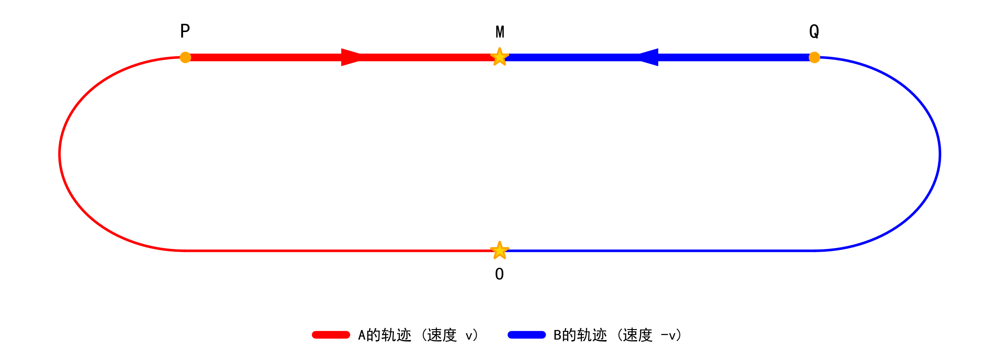

# 对称双生子实验 {#sec-symmetric-twins}

本章设计一个完全镜像对称的双生子实验，检验“钟慢效应”这一测量结果与随身时钟物理过程之间的关系。

## 实验过程

\begin{definition}[实验对象] \label{def-experiment-object}
设惯性参考系 $S$ 中存在两个质点 $A$ 和 $B$。在时空原点 $O$ 处，$A$ 与 $B$ 相遇并完成时钟对表。设此时 $S$ 系的坐标时 $t=0$，两者的随身时钟时（携带的时钟读数）分别记为 $\tau_{A}$ 和 $\tau_{B}$，且设 $\tau_{A} = \tau_{B} = 0$。
\end{definition}

\begin{definition}[路径分段] \label{def-path-segments}
从 $O$ 点出发，$A$ 和 $B$ 分别沿两条完全镜像对称的空间路径运动，在时空点 $M$ 再次相遇。其路径分为两个阶段：

\begin{enumerate}
  \item \textbf{弧线段 $O \rightarrow P$ 与 $O \rightarrow Q$}：$A$ 经过弧线到达点 $P$，$B$ 经过完全镜像的弧线到达点 $Q$。这两段过程包含了加速与转向。
  \item \textbf{直线段 $P \rightarrow M$ 与 $Q \rightarrow M$}：设 $A$ 到达 $P$ 点后，从点 $P$ 开始以恒定速度 $v$ 沿直线向 $M$ 运动，$B$ 到达 $Q$ 点后，从点 $Q$ 开始以恒定速度 $-v$ 沿直线向 $M$ 运动。
\end{enumerate}
\end{definition}

{#fig-twins width=95%}

\begin{axiom}[对称性公理] \label{ax-symmetry}
根据实验设定，路径 $O \rightarrow P \rightarrow M$ 与 $O \rightarrow Q \rightarrow M$ 关于中心轴 $OM$ 完美镜像对称。即：$A$ 和 $B$ 的物理经历在空间几何与动力学上完全等价。这一对称性在逻辑上确立了 $A$ 与 $B$ 的身份平等与可互换性。
\end{axiom}

## 钟慢效应
本章只研究路径分段（定义 \ref{def-path-segments}）中第 2 阶段直线段的惯性运动过程。

在 $A$ 的静止参考系 $S_A$ 中，$B$ 以相对速度 $v_{B/A}$ 运动。根据洛伦兹变换，$A$ 测量 $B$ 的时间会发生膨胀 @eq-time-dilation-A。

$$
\Delta t_A = \gamma \left( \Delta t_B + \frac{v_{B/A} \Delta x_B}{c^2} \right)
\quad \Longrightarrow \quad
\Delta t_B = \frac{1}{\gamma} \Delta t_A
$$ {#eq-time-dilation-A}

@eq-time-dilation-A 中，$B$ 的静止位置处$\Delta x_B = 0$，$\Delta t_B$ 是 $A$ 在 $S_A$ 系中通过洛伦兹变换计算出的时间， 揭示了$A$ 测量 $B$ 的时间流逝更慢。同理，在 $B$ 的静止参考系 $S_B$ 中，$B$ 也会得出 $A$ 的时间流逝更慢的结论。

## 对称性约束

根据对称性公理 \ref{ax-symmetry}，$A$ 和 $B$ 经历了完全镜像对称的物理过程。在 $M$ 点相遇时，两者随身时钟时相等，即 @eq-AQB 。

$$
\tau_{A} = \tau_{B}
$$ {#eq-AQB}

## 实验结论
在满足狭义相对论条件的前提下，狭义相对论测量时得到的“时间不一致”，与对称性确定的“随身时钟时相等”发生了冲突。这说明：狭义相对论测量出的时间差异，并不等同于物理上时钟实际经历的差异。“钟慢效应”是特定理论下的测量结果，它不等同于随身时钟读数的物理过程的真实发生。

